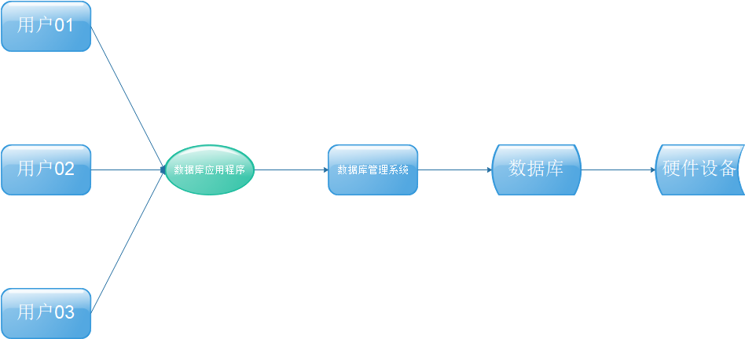

# MySQL数据库

## 概述

```
数据库是一个长期存储在计算机内的、有组织的、有共享的、统一管理的数据集合.
在数据库中的数据我们可以用二维表格的形式理解,例如
表格中一列的标题我们称之为字段
表格中一行数据我们称之为一条记录
```

```
数据库由3部分组成
数据库：用于存储数据
数据库管理系统：用户管理数据库的软件
数据库应用程序：为了提高数据库系统的管理能力使用的数据库管理的补充
```



```mysql
对数据库进行查询、修改操作的语言我们称之为SQL
结构化查询语言(Structured Query Language)简称SQL(发音：/ˈes kjuː ˈel/ "S-Q-L")，是一种特殊目的的编程语言，是一种数据库查询和程序设计语言，用于存取数据以及查询、更新和管理关系数据库系统；同时也是数据库脚本文件的扩展名。
标准：SQL-92、SQL-99、方言
常用关系型数据库
Oracle、MySQL、SQLServer、...
对象型数据库
PostgreSQL、...
常用的非关系数据库（在中国）
Redis、MongoDB、HBase、...
按照SQL-92标准SQL包含4部分
1、数据库定义语言(DDL)：create、drop、alter、...
2、数据库操作语言(DML)：insert、update、delete、...
3、数据库查询语言(DQL)：select
4、数据库控制语言(DCL)：commit、rollback、grant、revoke、...

```

## MySQL数据类型

### 数字类型

| 类型         | 大小                                     | 范围（有符号）                                               | 范围（无符号）                                               | 用途            |
| :----------- | :--------------------------------------- | :----------------------------------------------------------- | :----------------------------------------------------------- | :-------------- |
| TINYINT      | 1 byte                                   | (-128，127)                                                  | (0，255)                                                     | 小整数值        |
| SMALLINT     | 2 bytes                                  | (-32 768，32 767)                                            | (0，65 535)                                                  | 大整数值        |
| MEDIUMINT    | 3 bytes                                  | (-8 388 608，8 388 607)                                      | (0，16 777 215)                                              | 大整数值        |
| INT或INTEGER | 4 bytes                                  | (-2 147 483 648，2 147 483 647)                              | (0，4 294 967 295)                                           | 大整数值        |
| BIGINT       | 8 bytes                                  | (-9,223,372,036,854,775,808，9 223 372 036 854 775 807)      | (0，18 446 744 073 709 551 615)                              | 极大整数值      |
| FLOAT        | 4 bytes                                  | (-3.402 823 466 E+38，-1.175 494 351 E-38)，0，(1.175 494 351 E-38，3.402 823 466 351 E+38) | 0，(1.175 494 351 E-38，3.402 823 466 E+38)                  | 单精度 浮点数值 |
| DOUBLE       | 8 bytes                                  | (-1.797 693 134 862 315 7 E+308，-2.225 073 858 507 201 4 E-308)，0，(2.225 073 858 507 201 4 E-308，1.797 693 134 862 315 7 E+308) | 0，(2.225 073 858 507 201 4 E-308，1.797 693 134 862 315 7 E+308) | 双精度 浮点数值 |
| DECIMAL      | 对DECIMAL(M,D) ，如果M>D，为M+2否则为D+2 | 依赖于M和D的值                                               | 依赖于M和D的值                                               | 小数值          |

类型名称后加(M,D)来表示，M表示一共显式几位数字，D表示表示小数位数,M和D又称为精度和标度。当DECIMAL没有精度和标度是默认为DECIMAL(10,0)。

### 时间类型

| 类型      | 大小 ( bytes) | 范围                                                         | 格式                | 用途                     |
| :-------- | :------------ | :----------------------------------------------------------- | :------------------ | :----------------------- |
| DATE      | 3             | 1000-01-01/9999-12-31                                        | YYYY-MM-DD          | 日期值                   |
| TIME      | 3             | '-838:59:59'/'838:59:59'                                     | HH:MM:SS            | 时间值或持续时间         |
| YEAR      | 1             | 1901/2155                                                    | YYYY                | 年份值                   |
| DATETIME  | 8             | 1000-01-01 00:00:00/9999-12-31 23:59:59                      | YYYY-MM-DD HH:MM:SS | 混合日期和时间值         |
| TIMESTAMP | 4             | 1970-01-01 00:00:00/2038结束时间是第 **2147483647** 秒，北京时间 **2038-1-19 11:14:07**，格林尼治时间 2038年1月19日 凌晨 03:14:07 | YYYYMMDD HHMMSS     | 混合日期和时间值，时间戳 |

### 字符串类型

| 类型       | 大小                  | 用途                            |
| :--------- | :-------------------- | :------------------------------ |
| CHAR       | 0-255 bytes           | 定长字符串                      |
| VARCHAR    | 0-65535 bytes         | 变长字符串                      |
| TINYBLOB   | 0-255 bytes           | 不超过 255 个字符的二进制字符串 |
| TINYTEXT   | 0-255 bytes           | 短文本字符串                    |
| BLOB       | 0-65 535 bytes        | 二进制形式的长文本数据          |
| TEXT       | 0-65 535 bytes        | 长文本数据                      |
| MEDIUMBLOB | 0-16 777 215 bytes    | 二进制形式的中等长度文本数据    |
| MEDIUMTEXT | 0-16 777 215 bytes    | 中等长度文本数据                |
| LONGBLOB   | 0-4 294 967 295 bytes | 二进制形式的极大文本数据        |
| LONGTEXT   | 0-4 294 967 295 bytes | 极大文本数据                    |

char(n) 和 varchar(n) 中括号中 n 代表字符的个数，并不代表字节个数，比如 CHAR(30) 就可以存储 30 个字符。

CHAR 和 VARCHAR 类型类似，但它们保存和检索的方式不同。它们的最大长度和是否尾部空格被保留等方面也不同。在存储或检索过程中不进行大小写转换。

BINARY 和 VARBINARY 类似于 CHAR 和 VARCHAR，不同的是它们包含二进制字符串而不要非二进制字符串。也就是说，它们包含字节字符串而不是字符字符串。这说明它们没有字符集，并且排序和比较基于列值字节的数值值。

BLOB 是一个二进制大对象，可以容纳可变数量的数据。有 4 种 BLOB 类型：TINYBLOB、BLOB、MEDIUMBLOB 和 LONGBLOB。它们区别在于可容纳存储范围不同。

有 4 种 TEXT 类型：TINYTEXT、TEXT、MEDIUMTEXT 和 LONGTEXT。对应的这 4 种 BLOB 类型，可存储的最大长度不同，可根据实际情况选择。


## SQL操作

### 连接数据库

```mysql
mysql 命令格式： mysql -h 主机地址 -u 用户名 －p用户密码           
#注意用户名前可以有空格也可以没有空格，但是密码前必须没有空格，否则让你重新输入密。本地连接数据
#本地连接
mysql -uroot -p
```

如果刚安装好 MySQL，超级用户 root 是没有密码的，故直接回车即可进入到 MySQL

### 修改用户密码

```mysql
mysqladmin 命令用于修改用户密码。

mysqladmin 命令格式：mysqladmin -u 用户名 -p 旧密码 password 新密码

1, 给 root 加个密码 123456
首先进入目录 mysql\bin，然后键入以下命令：
mysqladmin -u root -password 123456
注：因为开始时 root 没有密码，所以-p 旧密码一项就可以省略了。

2. 再将 root 的密码改为 67890
mysqladmin -u root -p 123456 password 67890
```

### MySQL数据备份与还原:

```mysql
#在窗口输入 备份数据:	
mysqldump -h `IP` -u `用户名` -p `密码`  `数据库名` >
`存放的地址`/`文件名`.sql;
#实例:
mysqldump -h localhost -uroot -p mysqlName > /home/mysqlName.sql;

#use进入数据库后 还原数据:
source `.sql文件地址`
#实例:
use mysqlName;
source /home/mysqlName.sql;


```

###  grant on：新增用户

```mysql
#grant on 命令格式：grant select on 数据库.* to 用户名@登录主机 identified by “密码”;
grant select,insert,update,delete on *.* to [email=test1@”%]test1@”%[/email]” Identified by “abc”;
#增加一个用户 test2 密码为 abc，让他只可以在 localhost 上登录，并可以对数据库 mydb
#进行查询、插入、修改、删除的操作（localhost 指本地主机，即 MYSQL 数据库所在的那台主
#机），这样用户即使用知道 test2 的密码，他也无法从 internet 上直接访问数据库，只能通过
#MYSQL 主机上的 web 页来访问了。
grant select,insert,update,delete on mydb.* to [email=test2@localhost]test2@localhost[/email] identified by
“abc”;
如果你不想 test2 有密码，可以再打一个命令将密码消掉。
grant select,insert,update,delete on mydb.* to [email=test2@localhost]test2@localhost[/email] identified by “”;

```

### show:	查看

```mysql
#查看所有数据库的;
show databases;
+--------------------+
| Database           |
+--------------------+
| information_schema |
| mysql              |
| performance_schema |
| sys                |
+--------------------+
#查看表单所有表单
show tables;
+--------------------+
| Table        		 |
+--------------------+
|  table01			 |
|  table01         	 |
+--------------------+
#查看引擎
show engines;
#查看数据库 使用的编码集 
show create database mysqlName;
#查看表 的表结构信息; 
show create database mysqlName;
#输出结果:
| mysqlName | CREATE DATABASE `mysqlName` /*!40100 DEFAULT CHARACTER SET utf8 */ |
```

### create：创建

```mysql
# create 命令格式：create database <数据库名>;
create database `database01`;

#创建数据库并分配用户：
grant
select,insert,update,delete,create,drop,
alter on 数据库名.* to数据库名@localhost identified by '密码';
set password for '数据库名'@'localhost' = OLD_PASSWORD('密码');
#注意：中文 “密码”和“数据库”是户自己需要设置的。

#创建数据库
create database `数据库名` default character set `utf8`;

#创建表单
 create table `tableName`(
  #字段名 数据类型  字段描述
     `id`  int(11)  comment'编号',
     `name` varchar(50)  comment'名称',
     `salary` double(5,2) comment '员工薪资'
 )ENGINE=InnoDB DEFAULT CHARSET=utf8  
 #数据结构       默认      字符集 
 
```

###  常用约束

```mysql
 #此字段不能为空		 非空约束关键字not null

#如果不添加值			  默认值约束关键字default  

#字段里的值不能重复		唯一性约束 关键字unique

#非空约束 + 唯一性约束 = 主键约束

#主键					 约束关键字primary key	
#写法一(不推荐)
create table `tableName`(
	`id` int(11) primary key comment'描述',
    `name` varchar not null comment'描述'
)
#写法二(推荐)
create table `tableName`(
	`id` int(11) comment'描述',
	`name` varchar not null comment'描述',
    primary key(`id`)
)


#联合主键或者称之复合主键
create table `tableName`(
	`cid` int(11) comment'描述',
    `aid` int(11) comment'描述',
    `name` varchar not null comment'描述',
   primary key(`cid`,`aid`)
)

/*如果一个主键无法实现唯一性 则可以用多个主键联合到一起一次比较*/


#主键自增 关键字auto_increment
create table `tableName`(
	`id` int(11) auto_increment comment'描述',
	`name` varchar not null comment'描述',
    primary key(`id`)

)


#用于规定表单中字段的值	检查约束关键字check
#创建表时规定字段数据范围
create table `tableName`(
    #字段名  数据类型  规定的数据范围
	`体重` numeric(9,2) check(`体重`>0 and `体重`<=100),
    `性别` char(2) chek(`性别`='男' or `性别`='女'),
)
#创建表之后 添加check约束
alter table `tableName` add check (`字段`>0)
#如果需要 加约束名 
constraint `约束名`#加到add后
#删除check 约束
alter table `tableName`drop check`约束名`

```

```mysql
/*外键必须存在主从表的关联字段
  应用场景一对多或者多对一的关系
  先建主表*/
  
  #建表时建立外键约束
create table `tableName`(

	`id` int(11) auto_increment comment'描述',

	`name` varchar not null comment'描述',

    constraint `外键名`#可不写系统会自动生成
    foreign key(`外键字段名`)
    references `父表名`(`参照的字段名`)
)
#建表后 添加外键
alter table `子表名` add
constraint `外键名` #可不写系统会自动生成
foreign key(`外键字段名`)
references `父表名`(`参照字段名`);
  #规定:
  /*
  父表和子表必须使用相同的存储引擎，而且禁止使用临时表。
数据表的存储引擎只能为InnoDB。
	外键列和参照列必须具有相似的数据类型，也就是可以相互转换类型的列，比如 int 和 tinyint 可以，而 int 和 char 则不可以
	数字类型的长度以及是否有符号（是否unsigned）必须相同
字符类型的长度则可以不同。
	外键列和参照列必须创建索引。如果外键列不存在索引，MySQl将自动创建。
外键的名字不能重复
*/

#外键的约束:
/*
district：严格模式(默认), 父表不能删除或更新一个被子表引用的记录；

cascade：级联模式, 父表操作后，子表关联的数据也跟着一起操作。也就是父表删除或更新后自动删除或更新子表中匹配的行；

set null：置空模式, 父表操作后，子表对应的字段被置空，前提外键字段没有指定 NOT NULL ；

no action 标准的SQL 关键字，在 MySQl 中 作用与 district相同

SET DEFAULT 设默认值
  */
```

describe:  获取表结构信息

```mysql
	#在MySQL中， describe 和 explain 是同义词。可以使用两者中的任何一个来获取表结构信息或者查询执行计划（查询执行计划：对MySQL执行查询的解释）	
	#事实上，尽管说二者是同义词。但是 describe 更多地用于获取表结构信息；而 explain 更多用于获取查询执行计划。
#获取表信息信息
describe `表名` `字段栏`
#如何想要查看指定字段的信息 在后面加 `字段名`即可
```

### use:	使用数据库

```mysql
#使用 数据库名
use `mysqlName`;
#看到以下单词为成功使用数据库
Database change
```

### select:	查询

```mysql
#获取当前数据库名
select database();

#获取当前mysql版本
select version();

#显示当前时间
select now();

#获取日期年月日
select dayofmonth(current_date);#日
select month(current_date);#月
select year(current_date);#年

#显示字符串
select "字符串";

#当计算器用
select ((4 * 4) / 10 ) + 25;

#连接字符串
select concat(f_name, " ", l_name) 
as Name 
from employee_data 
where title = 'Marketing Executive';


#mysql表的select操作:

#查询所有
select * from `表名`;

#按字段查询
select`字段名01`,`字段名02` from `表名`;

#between and 查询语句
select `显示的字段栏` from `表名` where `字段栏` between `初始值` and `到最大`; #包含最小最大值 也可以来查字母
```

#### 聚合查询:

```mysql
#聚合函数
要注意聚合的计算结果虽然是一个数字，但查询的结果仍然是一个二维表，只是这个二维表只有一行一列，并且列名是COUNT()。
通常，使用聚合查询时，我们应该给列名设置一个别名，便于处理结果
select `聚合函数`as num from `表名`;

#常见聚合函数
sum(列名) 求和  　　　　
max(列名) 最大值 　　　　
min(列名) 最小值 　　　　
avg(列名) 平均值 　　　　
first(列名)   第一条记录   
last(列名)    最后一条记录  
count(列名)   统计记录数   注意和count(*)的区别

#过滤的顺序
on->join->where->group by->having

#Having与Where
where 子句的作用是在对查询结果进行分组前，将不符合where条件的行去掉，即在分组之前过滤数据，where条件中不能包含聚组函数，使用where条件过滤出特定的行。

having 子句的作用是筛选满足条件的组，即在分组之后过滤数据，条件中经常包含聚组函数，使用having 条件过滤出特定的组，也可以使用多个分组标准进行分组
```

**复合查询**

```mysql
#合并查询

#子查询是指嵌入在其他 sql 语句中的 select 语句，也叫嵌套查询；

#查询 一对多 实例:

select

e.id as eid,

e.name as ename,

c.name as cname

from

employee as e

inner join

company as c

on 1 and

 e.cid=c.id;


#多对多 查询 实例:

select

r.name,

ers.ename

from

(select

 e.id,

 e.name as ename,

 er.rid

 from 

 employee as e

 INNER JOIN

 EmpAndRol as er

 where

 e.id= er.eid

) as ers 

INNER JOIN

role as r

where

ers.rid=r.id

;


```

### 连接查询

#### 内连接查询 inner join

**关键字：inner join  on**

**语句**：**select \* from a_table a inner join b_table b on a.a_id = b.b_id;**

**说明**：组合两个表中的记录，返回关联字段相符的记录，也就是返回两个表的交集（阴影）部分。


案例解释：在boy表和girl 表中查出两表 hid 字段一致的姓名（gname，bname），boy表和girl 表如下：

   

**采用内连接查询方式：**

```
SELECT boy.hid,boy.bname,girl.gname FROM boy INNER JOIN girl ON girl.hid = boy.hid;
```

查询结果如下：


#### 二、左连接查询 left join

**关键字：left join on / left outer join on**

**语句：SELECT \* FROM a_table a left join b_table b ON a.a_id = b.b_id;**

**说明： left join 是left outer join的简写，它的全称是左外连接，是外连接中的一种。 左(外)连接，左表(a_table)的记录将会全部表示出来，而右表(b_table)只会显示符合搜索条件的记录。右表记录不足的地方均为NULL。**


案例解释：在boy表和girl 表中左连接查询，boy表和girl 表如下：

   

**采用内连接查询方式：**

```
SELECT boy.hid,boy.bname,girl.gname FROM boy LEFT JOIN girl ON girl.hid = boy.hid;
```

查询结果如下：


#### 三、右连接 right join

**关键字：right join on / right outer join on**

**语句：SELECT \* FROM a_table a right outer join b_table b on a.a_id = b.b_id;**

**说明：right join是right outer join的简写，它的全称是右外连接，是外连接中的一种。与左(外)连接相反，右(外)连接，左表(a_table)只会显示符合搜索条件的记录，而右表(b_table)的记录将会全部表示出来。左表记录不足的地方均为NULL。**


案例解释：在boy表和girl 表中右连接查询，boy表和girl 表如下：

   

**采用内连接查询方式：**

```
SELECT boy.hid,boy.bname,girl.gname FROM boy RIGHT JOIN girl ON girl.hid = boy.hid;
```

查询结果如下：


#### 四、全连接 union

**关键字：union /union all**

**语句：(select colum1,colum2...columN from tableA ) union (select colum1,colum2...columN from tableB )**

​     **或 (select colum1,colum2...columN from tableA ) union all (select colum1,colum2...columN from tableB )；**

**union语句注意事项：**

​     **1.通过union连接的SQL它们分别单独取出的列数必须相同；**

​     **2.不要求合并的表列名称相同时，以第一个sql 表列名为准；**

​     **3.使用union 时，完全相等的行，将会被合并，由于合并比较耗时，一般不直接使用 union 进行合并，而是通常采用union all 进行合并；**

​     **4.被union 连接的sql 子句，单个子句中不用写order by ，因为不会有排序的效果。但可以对最终的结果集进行排序；**

​      (select id,name from A order by id) union all (select id,name from B order by id); //没有排序效果

​      (select id,name from A ) union all (select id,name from B ) order by id; //有排序效果

案例解释：将a表和b表合并，表结构如下：

     

**采用 union 全连接：**


union会自动将完全重复的数据去除掉，a、b表中"c"的值都为15，所以只显示一行。

**采用 union all 全连接：**


union all会保留那些重复的数据；


### whers:  判断条件

```mysql
#按条件查询 关键字where
select `显示的字段栏` from `表名` where `条件`;
#多条件查询 and 或者 or
select `显示的字段栏` from `表名` where `条件1`and`条件2`;

#注意:  关键字binary
MySQL 的 where 子句的字符串比较是不区分大小写的。 你可以使用 binary 关键字来设定 where 子句的字符串比较是区分大小写的。
select `显示的字段栏` from `表名` where binary
`条件1`and`条件2`;

```

### order by: 排序

```mysql
#排序 关键字order by  
select `显示的字段栏` from `表名`
order by `指定排序的字段栏`  #[ASC 或 DESC]
/*
可以使用任何字段来作为排序的条件，从而返回排序后的查询结果。
可以设定多个字段来排序
可以使用 ASC 或 DESC 关键字来设置查询结果是按升序或降序排列。 默认情况下，是按升序排列
可以添加 WHERE...LIKE 子句来设置条件
*/
```

### group by: 分组

```mysql
#关键字 group by
select `显示的字段栏`, 函数(`字段栏`)
from `表名`
where `条件` 
group by `字段栏`;


# 关键字with rollup
with rollup 可以实现在分组统计数据基础上再进行相同的统计（SUM,AVG,COUNT…）。


#关键字coalesce
我们可以使用 coalesce 来设置一个可以取代 NUll 的名称，coalesce 语法：

select coalesce(a,b,c);

参数说明：如果a==null,则选择b；如果b==null,则选择c；如果a!=null,则选择a；如果a b c 都为null ，则返回为null（没意义）。

以下实例中如果名字为空我们使用总数代替：
```

### #in与exists语句

```mysql
#exists用法
select a.batchName,a.projectId from ucsc_project_batch a where exists (select b.id from ucsc_project b where a.projectId = b.id)
/*
	上面这条SQL的意思就是：以ucsc_project_batch为主表查询batchName与projectId字段，其中projectId字段存在于ucsc_project表中。

	EXISTS 会对外表ucsc_project_batch进行循环查询匹配，
	"它不在乎后面的内表子查询的返回值是什么，只在乎有没有存在返回值，
	存在返回值，则条件为真，该条数据匹配成功，
加入查询结果集中；如果没有返回值，条件为假，丢弃该条数据。"
*/


#in用法
select a.batchName,a.projectId from ucsc_project_batch a where a.projectId in  (select b.id from ucsc_project b)

#注意:
/*IN语句在mysql中没有参数个数的限制，但是mysql中SQL语句有长度大小限制，整段最大为4M*/

/*EXISTS的子查询语句不在乎查询的是什么，只在乎有没有结果集存在，存在则整个子查询可以看作一个条件为真的语句，不然就是一个条件为假的语句*/

/*IN语句对于子查询的返回字段只能由一个，不然会报错：*/

#场景选择:
/*外查询表大，子查询表小，选择IN；
外查询表小，子查询表大，选择EXISTS；
若两表差不多大，则差不多*/

#in和exists查询方式:
/*in
IN中的SQL查询只会查询一次，然后把结果集存在临时文件中，然后再与外层查询sql进行匹配，其中外查询与子查询都可以使用索引
*/
/*exists
EXISTS会对外查询的表 内字段外字段进行循环匹配 ，循环执行内查询表的字段总数次，其中子查询可以使用索引，外查询全表扫描
*/

```

``` 


#### drop:	移除

​```mysql
#移除 数据库   数据库名;
drop database `database01`;
#移除  模式    数据库
drop schema `190703_02`; 不懂
#移除 表单		表单
drop table `table01`

```

```mysql
drop
drop table table_name : 删除表全部数据和表结构，立刻释放磁盘空间，不管是 Innodb 和 MyISAM;

truncate 和 delete
truncate table table_name : 删除表全部数据，保留表结构，立刻释放磁盘空间 ，不管是 Innodb 和 MyISAM（truncate之后的自增字段从头开始计数）;
delete from table_name :
1>删除表全部数据，保留表结构，对于 MyISAM 会立刻释放磁盘空间，InnoDB 不会释放磁盘空间（delete后仍保留原来的数值的位置）;
2>若想实现带条件的删除，只有用delete
delete from table_name where xxx : 带条件的删除，表结构不变，不管是 innodb 还是 MyISAM 都不会释放磁盘空间（delete后仍保留原来的数值的位置）
```

## MySQL储存引擎:

```mysql
#InnoDB存储引擎
InnoDB是事务型数据库的首选引擎，通过上图也看到了，InnoDB是目前MYSQL的默认事务型引擎，是目前最重要、使用最广泛的存储引擎。支持事务安全表（ACID），支持行锁定和外键。InnoDB主要特性有：

1、InnoDB给MySQL提供了具有提交、回滚和崩溃恢复能力的事物安全（ACID兼容）存储引擎。InnoDB锁定在行级并且也在SELECT语句中提供一个类似Oracle的非锁定读。这些功能增加了多用户部署和性能。在SQL查询中，可以自由地将InnoDB类型的表和其他MySQL的表类型混合起来，甚至在同一个查询中也可以混合

2、InnoDB是为处理巨大数据量的最大性能设计。它的CPU效率可能是任何其他基于磁盘的关系型数据库引擎锁不能匹敌的

3、InnoDB存储引擎完全与MySQL服务器整合，InnoDB存储引擎为在主内存中缓存数据和索引而维持它自己的缓冲池。InnoDB将它的表和索引在一个逻辑表空间中，表空间可以包含数个文件（或原始磁盘文件）。这与MyISAM表不同，比如在MyISAM表中每个表被存放在分离的文件中。InnoDB表可以是任何尺寸，即使在文件尺寸被限制为2GB的操作系统上

4、InnoDB支持外键完整性约束，存储表中的数据时，每张表的存储都按主键顺序存放，如果没有显示在表定义时指定主键，InnoDB会为每一行生成一个6字节的ROWID，并以此作为主键

5、InnoDB被用在众多需要高性能的大型数据库站点上

InnoDB不创建目录，使用InnoDB时，MySQL将在MySQL数据目录下创建一个名为ibdata1的10MB大小的自动扩展数据文件，以及两个名为ib_logfile0和ib_logfile1的5MB大小的日志文件。

场景：由于其支持事务处理，支持外键，支持崩溃修复能力和并发控制。如果需要对事务的完整性要求比较高（比如银行），要求实现并发控制（比如售票），那选择InnoDB有很大的优势。如果需要频繁的更新、删除操作的数据库，也可以选择InnoDB，因为支持事务的提交（commit）和回滚（rollback）。


MEMORY存储引擎
MEMORY存储引擎将表中的数据存储到内存中，未查询和引用其他表数据提供快速访问。MEMORY主要特性有：

1、MEMORY表的每个表可以有多达32个索引，每个索引16列，以及500字节的最大键长度

2、MEMORY存储引擎执行HASH和BTREE缩影

3、可以在一个MEMORY表中有非唯一键值

4、MEMORY表使用一个固定的记录长度格式

5、MEMORY不支持BLOB或TEXT列

6、MEMORY支持AUTO_INCREMENT列和对可包含NULL值的列的索引

7、MEMORY表在所由客户端之间共享（就像其他任何非TEMPORARY表）

8、MEMORY表内存被存储在内存中，内存是MEMORY表和服务器在查询处理时的空闲中，创建的内部表共享

9、当不再需要MEMORY表的内容时，要释放被MEMORY表使用的内存，应该执行DELETE FROM或TRUNCATE TABLE，或者删除整个表（使用DROP TABLE）

MEMORY存储引擎默认使用哈希（HASH）索引，其速度比使用B-+Tree型要快，但也可以使用B树型索引。由于这种存储引擎所存储的数据保存在内存中，所以其保存的数据具有不稳定性，比如如果mysqld进程发生异常、重启或计算机关机等等都会造成这些数据的消失，所以这种存储引擎中的表的生命周期很短，一般只使用一次。现在mongodb、redis等NOSQL数据库愈发流行，MEMORY存储引擎的使用场景越来越少。

场景：如果需要该数据库中一个用于查询的临时表。
```

```mysql
#MyISAM存储引擎
MyISAM基于ISAM存储引擎，并对其进行扩展。它是在Web、数据仓储和其他应用环境下最常使用的存储引擎之一。MyISAM拥有较高的插入、查询速度，但不支持事物和外键。

MyISAM主要特性有：

1、大文件（达到63位文件长度）在支持大文件的文件系统和操作系统上被支持

2、当把删除和更新及插入操作混合使用的时候，动态尺寸的行产生更少碎片。这要通过合并相邻被删除的块，以及若下一个块被删除，就扩展到下一块自动完成

3、每个MyISAM表最大索引数是64，这可以通过重新编译来改变。每个索引最大的列数是16

4、最大的键长度是1000字节，这也可以通过编译来改变，对于键长度超过250字节的情况，一个超过1024字节的键将被用上

5、BLOB和TEXT列可以被索引，支持FULLTEXT类型的索引，而InnoDB不支持这种类型的索引

6、NULL被允许在索引的列中，这个值占每个键的0~1个字节

7、所有数字键值以高字节优先被存储以允许一个更高的索引压缩

8、每个MyISAM类型的表都有一个AUTO_INCREMENT的内部列，当INSERT和UPDATE操作的时候该列被更新，同时AUTO_INCREMENT列将被刷新。所以说，MyISAM类型表的AUTO_INCREMENT列更新比InnoDB类型的AUTO_INCREMENT更快

9、可以把数据文件和索引文件放在不同目录

10、每个字符列可以有不同的字符集

11、有VARCHAR的表可以固定或动态记录长度

12、VARCHAR和CHAR列可以多达64KB

存储格式：

1、静态表（默认）：字段都是非变长的（每个记录都是固定长度的）。存储非常迅速、容易缓存，出现故障容易恢复；占用空间通常比动态表多。

2、动态表：占用的空间相对较少，但是频繁的更新删除记录会产生碎片，需要定期执行optimize table或myisamchk -r命令来改善性能，而且出现故障的时候恢复比较困难。

3、压缩表：使用myisampack工具创建，占用非常小的磁盘空间。因为每个记录是被单独压缩的，所以只有非常小的访问开支。

静态表的数据在存储的时候会按照列的宽度定义补足空格，在返回数据给应用之前去掉这些空格。如果需要保存的内容后面本来就有空格，在返回结果的时候也会被去掉。（其实是数据类型char的行为，动态表中若有这个数据类型也同样会有这个问题）

使用MyISAM引擎创建数据库，将产生3个文件。文件的名字以表名字开始，扩展名之处文件类型：frm文件存储表定义、数据文件的扩展名为.MYD（MYData）、索引文件的扩展名时.MYI（MYIndex）。

场景：如果表主要是用于插入新记录和读出记录，那么选择MyISAM能实现处理高效率。

```

```mysql
#MERGE存储引擎
MERGE存储引擎是一组MyISAM表的组合，这些MyISAM表结构必须完全相同，尽管其使用不如其它引擎突出，但是在某些情况下非常有用。说白了，Merge表就是几个相同MyISAM表的聚合器；Merge表中并没有数据，对Merge类型的表可以进行查询、更新、删除操作，这些操作实际上是对内部的MyISAM表进行操作。

场景：对于服务器日志这种信息，一般常用的存储策略是将数据分成很多表，每个名称与特定的时间端相关。例如：可以用12个相同的表来存储服务器日志数据，每个表用对应各个月份的名字来命名。当有必要基于所有12个日志表的数据来生成报表，这意味着需要编写并更新多表查询，以反映这些表中的信息。与其编写这些可能出现错误的查询，不如将这些表合并起来使用一条查询，之后再删除Merge表，而不影响原来的数据，删除Merge表只是删除Merge表的定义，对内部的表没有任何影响。

```

```mysql
#ARCHIVE存储引擎
Archive是归档的意思，在归档之后很多的高级功能就不再支持了，仅仅支持最基本的插入和查询两种功能。在MySQL 5.5版以前，Archive是不支持索引，但是在MySQL 5.5以后的版本中就开始支持索引了。Archive拥有很好的压缩机制，它使用zlib压缩库，在记录被请求时会实时压缩，所以它经常被用来当做仓库使用。

场景：由于高压缩和快速插入的特点Archive非常适合作为日志表的存储引擎，但是前提是不经常对该表进行查询操作。
```

```mysql
#CSV存储引擎
使用该引擎的MySQL数据库表会在MySQL安装目录data文件夹中的和该表所在数据库名相同的目录中生成一个.CSV文件（所以，它可以将CSV类型的文件当做表进行处理），这种文件是一种普通文本文件，每个数据行占用一个文本行。该种类型的存储引擎不支持索引，即使用该种类型的表没有主键列；另外也不允许表中的字段为null。csv的编码转换需要格外注意。
场景：这种引擎支持从数据库中拷入/拷出CSV文件。如果从电子表格软件输出一个CSV文件，将其存放在MySQL服务器的数据目录中，服务器就能够马上读取相关的CSV文件。同样，如果写数据库到一个CSV表，外部程序也可以立刻读取它。在实现某种类型的日志记录时，CSV表作为一种数据交换格式，特别有用。
```

```mysql
#BLACKHOLE存储引擎（黑洞引擎）
该存储引擎支持事务，而且支持mvcc的行级锁，写入这种引擎表中的任何数据都会消失，主要用于做日志记录或同步归档的中继存储，这个存储引擎除非有特别目的，否则不适合使用。

场景：如果配置一主多从的话，多个从服务器会在主服务器上分别开启自己相对应的线程，执行binlogdump命令而且多个此类进程并不是共享的。为了避免因多个从服务器同时请求同样的事件而导致主机资源耗尽，可以单独建立一个伪的从服务器或者叫分发服务器。
```

```mysql
#PERFORMANCE_SCHEMA存储引擎
该引擎主要用于收集数据库服务器性能参数。这种引擎提供以下功能：提供进程等待的详细信息，包括锁、互斥变量、文件信息；保存历史的事件汇总信息，为提供MySQL服务器性能做出详细的判断；对于新增和删除监控事件点都非常容易，并可以随意改变mysql服务器的监控周期，例如（CYCLE、MICROSECOND）。 MySQL用户是不能创建存储引擎为PERFORMANCE_SCHEMA的表。

场景： DBA能够较明细得了解性能降低可能是由于哪些瓶颈。
```

```mysql
#Federated存储引擎
该存储引擎可以不同的Mysql服务器联合起来，逻辑上组成一个完整的数据库。这种存储引擎非常适合数据库分布式应用。

Federated存储引擎可以使你在本地数据库中访问远程数据库中的数据，针对federated存储引擎表的查询会被发送到远程数据库的表上执行，本地是不存储任何数据的。

缺点：

1.对本地虚拟表的结构修改，并不会修改远程表的结构

2.truncate 命令，会清除远程表数据

3. drop命令只会删除虚拟表，并不会删除远程表

4.不支持 alter table 命令

5. select count(*), select * from limit M, N 等语句执行效率非常低，数据量较大时存在很严重的问题，但是按主键或索引列查询，则很快，如以下查询就非常慢（假设 id 为主索引）

select id from db.tablea where id >100 limit 10 ;

而以下查询就很快：

select id from db.tablea where id >100 and id<150

6.  如果虚拟虚拟表中字段未建立索引，而实体表中为此字段建立了索引，此种情况下，性能也相当差。但是当给虚拟表建立索引后，性能恢复正常。

7. 类似 where name like "str%" limit 1 的查询，即使在 name 列上创建了索引，也会导致查询过慢，是因为federated引擎会将所有满足条件的记录读取到本地，再进行 limit 处理。

场景： dblink。
```


## MySQL 函数

### MySQL 字符串函数

| 函数                                  | 描述                                                         | 实例                                                         |
| :------------------------------------ | :----------------------------------------------------------- | :----------------------------------------------------------- |
| ASCII(s)                              | 返回字符串 s 的第一个字符的 ASCII 码。                       | 返回 CustomerName 字段第一个字母的 ASCII 码：`SELECT ASCII(CustomerName) AS NumCodeOfFirstChar FROM Customers;` |
| CHAR_LENGTH(s)                        | 返回字符串 s 的字符数                                        | 返回字符串 RUNOOB 的字符数`SELECT CHAR_LENGTH("RUNOOB") AS LengthOfString;` |
| CHARACTER_LENGTH(s)                   | 返回字符串 s 的字符数                                        | 返回字符串 RUNOOB 的字符数`SELECT CHARACTER_LENGTH("RUNOOB") AS LengthOfString;` |
| CONCAT(s1,s2...sn)                    | 字符串 s1,s2 等多个字符串合并为一个字符串                    | 合并多个字符串`SELECT CONCAT("SQL ", "Runoob ", "Gooogle ", "Facebook") AS ConcatenatedString;` |
| CONCAT_WS(x, s1,s2...sn)              | 同 CONCAT(s1,s2,...) 函数，但是每个字符串之间要加上 x，x 可以是分隔符 | 合并多个字符串，并添加分隔符：`SELECT CONCAT_WS("-", "SQL", "Tutorial", "is", "fun!")AS ConcatenatedString;` |
| FIELD(s,s1,s2...)                     | 返回第一个字符串 s 在字符串列表(s1,s2...)中的位置            | 返回字符串 c 在列表值中的位置：`SELECT FIELD("c", "a", "b", "c", "d", "e");` |
| FIND_IN_SET(s1,s2)                    | 返回在字符串s2中与s1匹配的字符串的位置                       | 返回字符串 c 在指定字符串中的位置：`SELECT FIND_IN_SET("c", "a,b,c,d,e");` |
| FORMAT(x,n)                           | 函数可以将数字 x 进行格式化 "#,###.##", 将 x 保留到小数点后 n 位，最后一位四舍五入。 | 格式化数字 "#,###.##" 形式：`SELECT FORMAT(250500.5634, 2);     -- 输出 250,500.56` |
| INSERT(s1,x,len,s2)                   | 字符串 s2 替换 s1 的 x 位置开始长度为 len 的字符串           | 从字符串第一个位置开始的 6 个字符替换为 runoob：`SELECT INSERT("google.com", 1, 6, "runoob");  -- 输出：runoob.com` |
| LOCATE(s1,s)                          | 从字符串 s 中获取 s1 的开始位置                              | 获取 b 在字符串 abc 中的位置：`SELECT LOCATE('st','myteststring');  -- 5`返回字符串 abc 中 b 的位置：`SELECT LOCATE('b', 'abc') -- 2` |
| LCASE(s)                              | 将字符串 s 的所有字母变成小写字母                            | 字符串 RUNOOB 转换为小写：`SELECT LCASE('RUNOOB') -- runoob` |
| LEFT(s,n)                             | 返回字符串 s 的前 n 个字符                                   | 返回字符串 runoob 中的前两个字符：`SELECT LEFT('runoob',2) -- ru` |
| LOWER(s)                              | 将字符串 s 的所有字母变成小写字母                            | 字符串 RUNOOB 转换为小写：`SELECT LOWER('RUNOOB') -- runoob` |
| LPAD(s1,len,s2)                       | 在字符串 s1 的开始处填充字符串 s2，使字符串长度达到 len      | 将字符串 xx 填充到 abc 字符串的开始处：`SELECT LPAD('abc',5,'xx') -- xxabc` |
| LTRIM(s)                              | 去掉字符串 s 开始处的空格                                    | 去掉字符串 RUNOOB开始处的空格：`SELECT LTRIM("    RUNOOB") AS LeftTrimmedString;-- RUNOOB` |
| MID(s,n,len)                          | 从字符串 s 的 n 位置截取长度为 len 的子字符串，同 SUBSTRING(s,n,len) | 从字符串 RUNOOB 中的第 2 个位置截取 3个 字符：`SELECT MID("RUNOOB", 2, 3) AS ExtractString; -- UNO` |
| POSITION(s1 IN s)                     | 从字符串 s 中获取 s1 的开始位置                              | 返回字符串 abc 中 b 的位置：`SELECT POSITION('b' in 'abc') -- 2` |
| REPEAT(s,n)                           | 将字符串 s 重复 n 次                                         | 将字符串 runoob 重复三次：`SELECT REPEAT('runoob',3) -- runoobrunoobrunoob` |
| REPLACE(s,s1,s2)                      | 将字符串 s2 替代字符串 s 中的字符串 s1                       | 将字符串 abc 中的字符 a 替换为字符 x：`SELECT REPLACE('abc','a','x') --xbc` |
| REVERSE(s)                            | 将字符串s的顺序反过来                                        | 将字符串 abc 的顺序反过来：`SELECT REVERSE('abc') -- cba`    |
| RIGHT(s,n)                            | 返回字符串 s 的后 n 个字符                                   | 返回字符串 runoob 的后两个字符：`SELECT RIGHT('runoob',2) -- ob` |
| RPAD(s1,len,s2)                       | 在字符串 s1 的结尾处添加字符串 s2，使字符串的长度达到 len    | 将字符串 xx 填充到 abc 字符串的结尾处：`SELECT RPAD('abc',5,'xx') -- abcxx` |
| RTRIM(s)                              | 去掉字符串 s 结尾处的空格                                    | 去掉字符串 RUNOOB 的末尾空格：`SELECT RTRIM("RUNOOB     ") AS RightTrimmedString;   -- RUNOOB` |
| SPACE(n)                              | 返回 n 个空格                                                | 返回 10 个空格：`SELECT SPACE(10);`                          |
| STRCMP(s1,s2)                         | 比较字符串 s1 和 s2，如果 s1 与 s2 相等返回 0 ，如果 s1>s2 返回 1，如果 s1<s2 返回 -1 | 比较字符串：`SELECT STRCMP("runoob", "runoob");  -- 0`       |
| SUBSTR(s, start, length)              | 从字符串 s 的 start 位置截取长度为 length 的子字符串         | 从字符串 RUNOOB 中的第 2 个位置截取 3个 字符：`SELECT SUBSTR("RUNOOB", 2, 3) AS ExtractString; -- UNO` |
| SUBSTRING(s, start, length)           | 从字符串 s 的 start 位置截取长度为 length 的子字符串         | 从字符串 RUNOOB 中的第 2 个位置截取 3个 字符：`SELECT SUBSTRING("RUNOOB", 2, 3) AS ExtractString; -- UNO` |
| SUBSTRING_INDEX(s, delimiter, number) | 返回从字符串 s 的第 number 个出现的分隔符 delimiter 之后的子串。 如果 number 是正数，返回第 number 个字符左边的字符串。 如果 number 是负数，返回第(number 的绝对值(从右边数))个字符右边的字符串。 | `SELECT SUBSTRING_INDEX('a*b','*',1) -- a SELECT SUBSTRING_INDEX('a*b','*',-1)  -- b SELECT SUBSTRING_INDEX(SUBSTRING_INDEX('a*b*c*d*e','*',3),'*',-1)  -- c` |
| TRIM(s)                               | 去掉字符串 s 开始和结尾处的空格                              | 去掉字符串 RUNOOB 的首尾空格：`SELECT TRIM('    RUNOOB    ') AS TrimmedString;` |
| UCASE(s)                              | 将字符串转换为大写                                           | 将字符串 runoob 转换为大写：`SELECT UCASE("runoob"); -- RUNOOB` |
| UPPER(s)                              | 将字符串转换为大写                                           | 将字符串 runoob 转换为大写：`SELECT UPPER("runoob"); -- RUNOOB` |

------

### MySQL 数字函数

| 函数名                             | 描述                                                         | 实例                                                         |
| :--------------------------------- | :----------------------------------------------------------- | :----------------------------------------------------------- |
| ABS(x)                             | 返回 x 的绝对值                                              | 返回 -1 的绝对值：`SELECT ABS(-1) -- 返回1`                  |
| ACOS(x)                            | 求 x 的反余弦值(参数是弧度)                                  | `SELECT ACOS(0.25);`                                         |
| ASIN(x)                            | 求反正弦值(参数是弧度)                                       | `SELECT ASIN(0.25);`                                         |
| ATAN(x)                            | 求反正切值(参数是弧度)                                       | `SELECT ATAN(2.5);`                                          |
| ATAN2(n, m)                        | 求反正切值(参数是弧度)                                       | `SELECT ATAN2(-0.8, 2);`                                     |
| AVG(expression)                    | 返回一个表达式的平均值，expression 是一个字段                | 返回 Products 表中Price 字段的平均值：`SELECT AVG(Price) AS AveragePrice FROM Products;` |
| CEIL(x)                            | 返回大于或等于 x 的最小整数                                  | `SELECT CEIL(1.5) -- 返回2`                                  |
| CEILING(x)                         | 返回大于或等于 x 的最小整数                                  | `SELECT CEILING(1.5); -- 返回2`                              |
| COS(x)                             | 求余弦值(参数是弧度)                                         | `SELECT COS(2);`                                             |
| COT(x)                             | 求余切值(参数是弧度)                                         | `SELECT COT(6);`                                             |
| COUNT(expression)                  | 返回查询的记录总数，expression 参数是一个字段或者 * 号       | 返回 Products 表中 products 字段总共有多少条记录：`SELECT COUNT(ProductID) AS NumberOfProducts FROM Products;` |
| DEGREES(x)                         | 将弧度转换为角度                                             | `SELECT DEGREES(3.1415926535898) -- 180`                     |
| n DIV m                            | 整除，n 为被除数，m 为除数                                   | 计算 10 除于 5：`SELECT 10 DIV 5;  -- 2`                     |
| EXP(x)                             | 返回 e 的 x 次方                                             | 计算 e 的三次方：`SELECT EXP(3) -- 20.085536923188`          |
| FLOOR(x)                           | 返回小于或等于 x 的最大整数                                  | 小于或等于 1.5 的整数：`SELECT FLOOR(1.5) -- 返回1`          |
| GREATEST(expr1, expr2, expr3, ...) | 返回列表中的最大值                                           | 返回以下数字列表中的最大值：`SELECT GREATEST(3, 12, 34, 8, 25); -- 34`返回以下字符串列表中的最大值：`SELECT GREATEST("Google", "Runoob", "Apple");   -- Runoob` |
| LEAST(expr1, expr2, expr3, ...)    | 返回列表中的最小值                                           | 返回以下数字列表中的最小值：`SELECT LEAST(3, 12, 34, 8, 25); -- 3`返回以下字符串列表中的最小值：`SELECT LEAST("Google", "Runoob", "Apple");   -- Apple` |
| LN                                 | 返回数字的自然对数，以 e 为底。                              | 返回 2 的自然对数：`SELECT LN(2);  -- 0.6931471805599453`    |
| LOG(x) 或 LOG(base, x)             | 返回自然对数(以 e 为底的对数)，如果带有 base 参数，则 base 为指定带底数。 | `SELECT LOG(20.085536923188) -- 3 SELECT LOG(2, 4); -- 2`    |
| LOG10(x)                           | 返回以 10 为底的对数                                         | `SELECT LOG10(100) -- 2`                                     |
| LOG2(x)                            | 返回以 2 为底的对数                                          | 返回以 2 为底 6 的对数：`SELECT LOG2(6);  -- 2.584962500721156` |
| MAX(expression)                    | 返回字段 expression 中的最大值                               | 返回数据表 Products 中字段 Price 的最大值：`SELECT MAX(Price) AS LargestPrice FROM Products;` |
| MIN(expression)                    | 返回字段 expression 中的最小值                               | 返回数据表 Products 中字段 Price 的最小值：`SELECT MIN(Price) AS MinPrice FROM Products;` |
| MOD(x,y)                           | 返回 x 除以 y 以后的余数                                     | 5 除于 2 的余数：`SELECT MOD(5,2) -- 1`                      |
| PI()                               | 返回圆周率(3.141593）                                        | `SELECT PI() --3.141593`                                     |
| POW(x,y)                           | 返回 x 的 y 次方                                             | 2 的 3 次方：`SELECT POW(2,3) -- 8`                          |
| POWER(x,y)                         | 返回 x 的 y 次方                                             | 2 的 3 次方：`SELECT POWER(2,3) -- 8`                        |
| RADIANS(x)                         | 将角度转换为弧度                                             | 180 度转换为弧度：`SELECT RADIANS(180) -- 3.1415926535898`   |
| RAND()                             | 返回 0 到 1 的随机数                                         | `SELECT RAND() --0.93099315644334`                           |
| ROUND(x)                           | 返回离 x 最近的整数                                          | `SELECT ROUND(1.23456) --1`                                  |
| SIGN(x)                            | 返回 x 的符号，x 是负数、0、正数分别返回 -1、0 和 1          | `SELECT SIGN(-10) -- (-1)`                                   |
| SIN(x)                             | 求正弦值(参数是弧度)                                         | `SELECT SIN(RADIANS(30)) -- 0.5`                             |
| SQRT(x)                            | 返回x的平方根                                                | 25 的平方根：`SELECT SQRT(25) -- 5`                          |
| SUM(expression)                    | 返回指定字段的总和                                           | 计算 OrderDetails 表中字段 Quantity 的总和：`SELECT SUM(Quantity) AS TotalItemsOrdered FROM OrderDetails;` |
| TAN(x)                             | 求正切值(参数是弧度)                                         | `SELECT TAN(1.75);  -- -5.52037992250933`                    |
| TRUNCATE(x,y)                      | 返回数值 x 保留到小数点后 y 位的值（与 ROUND 最大的区别是不会进行四舍五入） | `SELECT TRUNCATE(1.23456,3) -- 1.234`                        |

------

### MySQL 日期函数

| 函数名                            | 描述                                                         | 实例                                                         |
| :-------------------------------- | :----------------------------------------------------------- | :----------------------------------------------------------- |
| ADDDATE(d,n)                      | 计算起始日期 d 加上 n 天的日期                               | `SELECT ADDDATE("2017-06-15", INTERVAL 10 DAY); ->2017-06-25` |
| ADDTIME(t,n)                      | n 是一个时间表达式，时间 t 加上时间表达式 n                  | 加 5 秒：`SELECT ADDTIME('2011-11-11 11:11:11', 5); ->2011-11-11 11:11:16 (秒)`添加 2 小时, 10 分钟, 5 秒:`SELECT ADDTIME("2020-06-15 09:34:21", "2:10:5");  -> 2020-06-15 11:44:26` |
| CURDATE()                         | 返回当前日期                                                 | `SELECT CURDATE(); -> 2018-09-19`                            |
| CURRENT_DATE()                    | 返回当前日期                                                 | `SELECT CURRENT_DATE(); -> 2018-09-19`                       |
| CURRENT_TIME                      | 返回当前时间                                                 | `SELECT CURRENT_TIME(); -> 19:59:02`                         |
| CURRENT_TIMESTAMP()               | 返回当前日期和时间                                           | `SELECT CURRENT_TIMESTAMP() -> 2018-09-19 20:57:43`          |
| CURTIME()                         | 返回当前时间                                                 | `SELECT CURTIME(); -> 19:59:02`                              |
| DATE()                            | 从日期或日期时间表达式中提取日期值                           | `SELECT DATE("2017-06-15");     -> 2017-06-15`               |
| DATEDIFF(d1,d2)                   | 计算日期 d1->d2 之间相隔的天数                               | `SELECT DATEDIFF('2001-01-01','2001-02-02') -> -32`          |
| DATE_ADD(d，INTERVAL expr type)   | 计算起始日期 d 加上一个时间段后的日期                        | `SELECT ADDDATE('2011-11-11 11:11:11',1) -> 2011-11-12 11:11:11  (默认是天) SELECT ADDDATE('2011-11-11 11:11:11', INTERVAL 5 MINUTE) -> 2011-11-11 11:16:11 (TYPE的取值与上面那个列出来的函数类似)` |
| DATE_FORMAT(d,f)                  | 按表达式 f的要求显示日期 d                                   | `SELECT DATE_FORMAT('2011-11-11 11:11:11','%Y-%m-%d %r') -> 2011-11-11 11:11:11 AM` |
| DATE_SUB(date,INTERVAL expr type) | 函数从日期减去指定的时间间隔。                               | Orders 表中 OrderDate 字段减去 2 天：`SELECT OrderId,DATE_SUB(OrderDate,INTERVAL 2 DAY) AS OrderPayDate FROM Orders` |
| DAY(d)                            | 返回日期值 d 的日期部分                                      | `SELECT DAY("2017-06-15");   -> 15`                          |
| DAYNAME(d)                        | 返回日期 d 是星期几，如 Monday,Tuesday                       | `SELECT DAYNAME('2011-11-11 11:11:11') ->Friday`             |
| DAYOFMONTH(d)                     | 计算日期 d 是本月的第几天                                    | `SELECT DAYOFMONTH('2011-11-11 11:11:11') ->11`              |
| DAYOFWEEK(d)                      | 日期 d 今天是星期几，1 星期日，2 星期一，以此类推            | `SELECT DAYOFWEEK('2011-11-11 11:11:11') ->6`                |
| DAYOFYEAR(d)                      | 计算日期 d 是本年的第几天                                    | `SELECT DAYOFYEAR('2011-11-11 11:11:11') ->315`              |
| EXTRACT(type FROM d)              | 从日期 d 中获取指定的值，type 指定返回的值。 type可取值为： MICROSECONDSECONDMINUTEHOURDAYWEEKMONTHQUARTERYEARSECOND_MICROSECONDMINUTE_MICROSECONDMINUTE_SECONDHOUR_MICROSECONDHOUR_SECONDHOUR_MINUTEDAY_MICROSECONDDAY_SECONDDAY_MINUTEDAY_HOURYEAR_MONTH | `SELECT EXTRACT(MINUTE FROM '2011-11-11 11:11:11')  -> 11`   |
| FROM_DAYS(n)                      | 计算从 0000 年 1 月 1 日开始 n 天后的日期                    | `SELECT FROM_DAYS(1111) -> 0003-01-16`                       |
| HOUR(t)                           | 返回 t 中的小时值                                            | `SELECT HOUR('1:2:3') -> 1`                                  |
| LAST_DAY(d)                       | 返回给给定日期的那一月份的最后一天                           | `SELECT LAST_DAY("2017-06-20"); -> 2017-06-30`               |
| LOCALTIME()                       | 返回当前日期和时间                                           | `SELECT LOCALTIME() -> 2018-09-19 20:57:43`                  |
| LOCALTIMESTAMP()                  | 返回当前日期和时间                                           | `SELECT LOCALTIMESTAMP() -> 2018-09-19 20:57:43`             |
| MAKEDATE(year, day-of-year)       | 基于给定参数年份 year 和所在年中的天数序号 day-of-year 返回一个日期 | `SELECT MAKEDATE(2017, 3); -> 2017-01-03`                    |
| MAKETIME(hour, minute, second)    | 组合时间，参数分别为小时、分钟、秒                           | `SELECT MAKETIME(11, 35, 4); -> 11:35:04`                    |
| MICROSECOND(date)                 | 返回日期参数所对应的微秒数                                   | `SELECT MICROSECOND("2017-06-20 09:34:00.000023"); -> 23`    |
| MINUTE(t)                         | 返回 t 中的分钟值                                            | `SELECT MINUTE('1:2:3') -> 2`                                |
| MONTHNAME(d)                      | 返回日期当中的月份名称，如 November                          | `SELECT MONTHNAME('2011-11-11 11:11:11') -> November`        |
| MONTH(d)                          | 返回日期d中的月份值，1 到 12                                 | `SELECT MONTH('2011-11-11 11:11:11') ->11`                   |
| NOW()                             | 返回当前日期和时间                                           | `SELECT NOW() -> 2018-09-19 20:57:43`                        |
| PERIOD_ADD(period, number)        | 为 年-月 组合日期添加一个时段                                | `SELECT PERIOD_ADD(201703, 5);    -> 201708`                 |
| PERIOD_DIFF(period1, period2)     | 返回两个时段之间的月份差值                                   | `SELECT PERIOD_DIFF(201710, 201703); -> 7`                   |
| QUARTER(d)                        | 返回日期d是第几季节，返回 1 到 4                             | `SELECT QUARTER('2011-11-11 11:11:11') -> 4`                 |
| SECOND(t)                         | 返回 t 中的秒钟值                                            | `SELECT SECOND('1:2:3') -> 3`                                |
| SEC_TO_TIME(s)                    | 将以秒为单位的时间 s 转换为时分秒的格式                      | `SELECT SEC_TO_TIME(4320) -> 01:12:00`                       |
| STR_TO_DATE(string, format_mask)  | 将字符串转变为日期                                           | `SELECT STR_TO_DATE("August 10 2017", "%M %d %Y"); -> 2017-08-10` |
| SUBDATE(d,n)                      | 日期 d 减去 n 天后的日期                                     | `SELECT SUBDATE('2011-11-11 11:11:11', 1) ->2011-11-10 11:11:11 (默认是天)` |
| SUBTIME(t,n)                      | 时间 t 减去 n 秒的时间                                       | `SELECT SUBTIME('2011-11-11 11:11:11', 5) ->2011-11-11 11:11:06 (秒)` |
| SYSDATE()                         | 返回当前日期和时间                                           | `SELECT SYSDATE() -> 2018-09-19 20:57:43`                    |
| TIME(expression)                  | 提取传入表达式的时间部分                                     | `SELECT TIME("19:30:10"); -> 19:30:10`                       |
| TIME_FORMAT(t,f)                  | 按表达式 f 的要求显示时间 t                                  | `SELECT TIME_FORMAT('11:11:11','%r') 11:11:11 AM`            |
| TIME_TO_SEC(t)                    | 将时间 t 转换为秒                                            | `SELECT TIME_TO_SEC('1:12:00') -> 4320`                      |
| TIMEDIFF(time1, time2)            | 计算时间差值                                                 | `SELECT TIMEDIFF("13:10:11", "13:10:10"); -> 00:00:01`       |
| TIMESTAMP(expression, interval)   | 单个参数时，函数返回日期或日期时间表达式；有2个参数时，将参数加和 | `SELECT TIMESTAMP("2017-07-23",  "13:10:11"); -> 2017-07-23 13:10:11` |
| TO_DAYS(d)                        | 计算日期 d 距离 0000 年 1 月 1 日的天数                      | `SELECT TO_DAYS('0001-01-01 01:01:01') -> 366`               |
| WEEK(d)                           | 计算日期 d 是本年的第几个星期，范围是 0 到 53                | `SELECT WEEK('2011-11-11 11:11:11') -> 45`                   |
| WEEKDAY(d)                        | 日期 d 是星期几，0 表示星期一，1 表示星期二                  | `SELECT WEEKDAY("2017-06-15"); -> 3`                         |
| WEEKOFYEAR(d)                     | 计算日期 d 是本年的第几个星期，范围是 0 到 53                | `SELECT WEEKOFYEAR('2011-11-11 11:11:11') -> 45`             |
| YEAR(d)                           | 返回年份                                                     | `SELECT YEAR("2017-06-15"); -> 2017`                         |
| YEARWEEK(date, mode)              | 返回年份及第几周（0到53），mode 中 0 表示周天，1表示周一，以此类推 | `SELECT YEARWEEK("2017-06-15"); -> 201724`                   |

------

### MySQL 高级函数

| 函数名                                                       | 描述                                                         | 实例                                                         |
| :----------------------------------------------------------- | :----------------------------------------------------------- | :----------------------------------------------------------- |
| BIN(x)                                                       | 返回 x 的二进制编码                                          | 15 的 2 进制编码:`SELECT BIN(15); -- 1111`                   |
| BINARY(s)                                                    | 将字符串 s 转换为二进制字符串                                | `SELECT BINARY "RUNOOB"; -> RUNOOB`                          |
| `CASE expression    WHEN condition1 THEN result1    WHEN condition2 THEN result2   ...    WHEN conditionN THEN resultN    ELSE result END` | CASE 表示函数开始，END 表示函数结束。如果 condition1 成立，则返回 result1, 如果 condition2 成立，则返回 result2，当全部不成立则返回 result，而当有一个成立之后，后面的就不执行了。 | `SELECT CASE  　WHEN 1 > 0 　THEN '1 > 0' 　WHEN 2 > 0 　THEN '2 > 0' 　ELSE '3 > 0' 　END ->1 > 0` |
| CAST(x AS type)                                              | 转换数据类型                                                 | 字符串日期转换为日期：`SELECT CAST("2017-08-29" AS DATE); -> 2017-08-29` |
| COALESCE(expr1, expr2, ...., expr_n)                         | 返回参数中的第一个非空表达式（从左向右）                     | `SELECT COALESCE(NULL, NULL, NULL, 'runoob.com', NULL, 'google.com'); -> runoob.com` |
| CONNECTION_ID()                                              | 返回唯一的连接 ID                                            | `SELECT CONNECTION_ID(); -> 4292835`                         |
| CONV(x,f1,f2)                                                | 返回 f1 进制数变成 f2 进制数                                 | `SELECT CONV(15, 10, 2); -> 1111`                            |
| CONVERT(s USING cs)                                          | 函数将字符串 s 的字符集变成 cs                               | `SELECT CHARSET('ABC') ->utf-8     SELECT CHARSET(CONVERT('ABC' USING gbk)) ->gbk` |
| CURRENT_USER()                                               | 返回当前用户                                                 | `SELECT CURRENT_USER(); -> guest@%`                          |
| DATABASE()                                                   | 返回当前数据库名                                             | `SELECT DATABASE();    -> runoob`                            |
| IF(expr,v1,v2)                                               | 如果表达式 expr 成立，返回结果 v1；否则，返回结果 v2。       | `SELECT IF(1 > 0,'正确','错误')     ->正确`                  |
| [IFNULL(v1,v2)](https://www.runoob.com/mysql/mysql-func-ifnull.html) | 如果 v1 的值不为 NULL，则返回 v1，否则返回 v2。              | `SELECT IFNULL(null,'Hello Word') ->Hello Word`              |
| ISNULL(expression)                                           | 判断表达式是否为 NULL                                        | `SELECT ISNULL(NULL); ->1`                                   |
| LAST_INSERT_ID()                                             | 返回最近生成的 AUTO_INCREMENT 值                             | `SELECT LAST_INSERT_ID(); ->6`                               |
| NULLIF(expr1, expr2)                                         | 比较两个字符串，如果字符串 expr1 与 expr2 相等 返回 NULL，否则返回 expr1 | `SELECT NULLIF(25, 25); ->`                                  |
| SESSION_USER()                                               | 返回当前用户                                                 | `SELECT SESSION_USER(); -> guest@%`                          |
| SYSTEM_USER()                                                | 返回当前用户                                                 | `SELECT SYSTEM_USER(); -> guest@%`                           |
| USER()                                                       | 返回当前用户                                                 | `SELECT USER(); -> guest@%`                                  |
| VERSION()                                                    | 返回数据库的版本号                                           | `SELECT VERSION() -> 5.6.34`                                 |