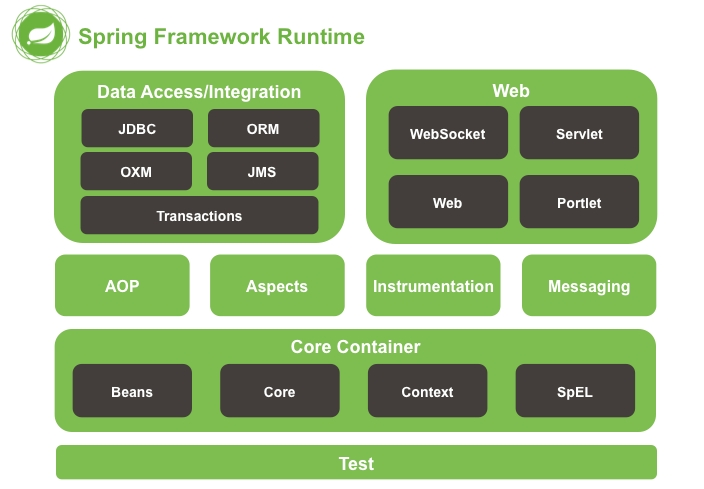
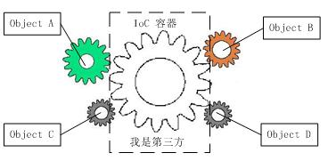

# Spring笔记

## Spring概念:

> 　　Spring是一种多层的J2EE应用程序框架，其核心就是管理资源组件以及依赖关系，Spring框架为现代基于java的企业应用程序提供了一个全面的编程和配置模型。
>
> ### Spring核心组件:　
>
> ### 1.Core Container 
>
> 　　Core Container包含了spring-core, spring-beans, spring-context, spring-context-support, spring-expression (Spring Expression Language) 模块，spring-core和spring-beans模块提供了框架的基本部分，包括IoC（控制反转）和DI（依赖项注入）特性。Context模块模构建于Core和Beans模块基础之上，提供了一种类似JNDI注册器的框架式的对象访问方法；Context 模块继承了Beans的特性，为 Spring 核心提供了大量扩展，添加了对国际化（例如资源绑定）、事件传播、资源加载和对Context的透明创建的支持。Context模块同时也支持J2EE的一些特性，ApplicationContext接口是Context模块的关键；SpEL模块提供了强大的表达式语言，用于在运行时查询和操纵对象。
>
> ### 　　2.AOP and Instrumentation　
>
> 　　spring-aop模块提供了一个AOP规范的面向切面的编程方式，允许您定义方法拦截器和切入点，以便处理一些横切性问题，比如日志，权限，数据验证，监控性能等。Aspects模块提供了对AspectJ的支持；Instrumentation模块提供了class instrumentation支持和classloader实现，使用 Instrumentation，开发者可以构建一个独立于应用程序的代理程序（Agent），用来监测和协助运行在 JVM 上的程序，甚至能够替换和修改某些类的定义。有了这样的功能，开发者就可以实现更为灵活的运行时虚拟机监控和Java类操作了，这样的特性实际上提供了一种虚拟机级别支持的 AOP 实现方式（**这块涉及到javaagent后续章节介绍**）。
>
> ### 　　3.Messaging
>
> 　　Spring消息模块，其中包含来自Spring集成项目的关键抽象，如Message、MessageChannel、MessageHandler等，可以作为基于消息的应用程序的基础。
>
> ### 　　4.Data Access/Integration
>
> 　　Data Access/Integration包含了JDBC, ORM, OXM, JMS, 和Transaction模块，spring-jdbc模块提供了一个JDBC抽象层，消除了对特定于数据库供应商的错误代码进行冗长的JDBC编码和解析的需要；spring-tx模块支持对实现特殊接口的类和所有pojo的编程和声明性事务管理；spring-orm模块为目前流行的对象关系映射api(包括JPA和Hibernate)提供集成层。使用spring-orm模块，您可以将所有这些ORM映射框架与Spring提供的所有其他特性结合使用，比如前面提到的简单声明性事务管理特性；spring-oxm模块提供了一个抽象层，支持对象/XML映射实现，如JAXB、Castor、XMLBeans、JiBX和XStream；spring-jms模块(Java消息传递服务)包含用于生成和消费消息的特性。
>
> ### 　　5.Web
>
> 　　Web层由spring-web、spring-webmvc、spring-websocket和spring-webmvc-portlet模块组成，spring-web模块提供了基本的面向web的集成特性，比如多部分文件上传功能，以及使用Servlet侦听器和面向web的应用程序上下文初始化IoC容器；Spring -webmvc模块(也称为Web- servlet模块)包含Spring的模型-视图-控制器(MVC)和Web应用程序的Rest Web服务实现；spring-webmvc- Portlet模块(也称为Web-Portlet模块)提供了要在Portlet环境中使用的MVC实现，并反映了基于servlet的spring-webmvc模块的功能。
>
> ### 　　6.Test
>
> 　　Spring -test模块支持使用JUnit或TestNG对Spring组件进行单元测试和集成测试。它提供了Spring applicationcontext的一致加载和这些上下文的缓存。它还提供了模拟对象，您可以使用这些对象独立写单元测试代码

## Spring核心:

核心就是管理资组件及其依赖关系，包括IoC（Inversion of Control 控制反转）DI(Dependency Injection 依赖注入),Aop (Aspect Oriented Programming 面向切面编程)

### Spting-IoC:

IoC控制反转概念:

 资源（组件）不再由使用资源双方进行管理，而是由不使用资源的第三方统一管理，这样带来的好处。第一，资源的集中管理，实现资源的可配置和易管理。第二，降低了使用资源双方的依赖程度，也就是我们说的耦合

控制反转是一种通过描述(在Java中可以是XML或者注解)并通过第三方去产生或获取特定对象的方式。
　　在Spring中实现控制反转的是IoC容器，其实现方法是依赖注入（Dependency Injection，DI）。

Spring IoC容器的作用，它可以容纳我们所开发的各种Bean，并且我们可以从中获取各种发布在Spring IoC容器里的Bean，并且通过描述可以得到它。

Spring IoC容器的设计主要是基于BeanFactory和Applica-tionContext两个接口，其中ApplicationContext是BeanFactory的子接口之一，换句话说BeanFactory是Spring IoC容器所定义的最底层接口，而ApplicationContext是其高级接口之一，并且对BeanFactory功能做了许多有用的扩展，所以在绝大部分的工作场景下，都会使用ApplicationContext作为Spring IoC容器

### Spring-AOP:

　　Aop（Aspect Oriented Programming面向切面编程）：我们知道OOP（面向对象编程）针对业务处理过程的实体及其属性和行为进行抽象封装，以获得更加清晰高效的逻辑单元划分，如果在应用开发过程中，如果产生横切性问题，比如日志记录，权限验证，监控性能等，这个时候AOP就上场了，AOP是通过预编译方式或者运行期动态代理实现的一种方式，AOP可以对业务逻辑的各个部分进行隔离，从

## MVC 设计概述